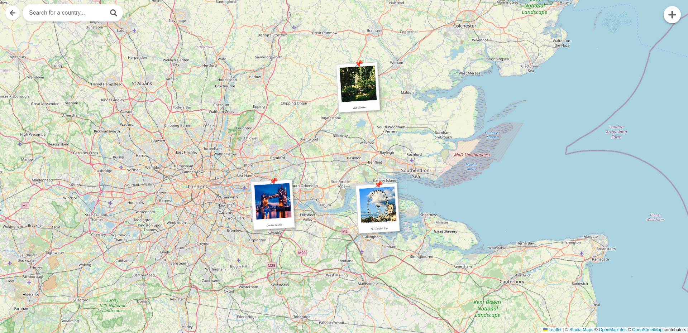

# Trail-Tale -  Interactive Photo Gallery Map

## Overview

Welcome to the Interactive Photo Gallery Map! This project is a web application that allows users to explore a world map, view and tag images as Polaroid-style markers, edit image details, and search for countries to navigate the map. It's built with Next.js, TypeScript, and Leaflet.js, focusing on a dynamic and engaging user experience.

## Features

* **Interactive World Map:**
    * Powered by Leaflet.js with custom map tiles.
    * Smooth zooming and panning with defined boundaries.
    * Highlights countries on mouseover and zooms/flies to a country on click.
    * Country-specific zoom adjustments for better viewing of large/small nations.
* **Dynamic Polaroid Image Markers:**
    * Images are displayed as unique Polaroid-style markers at their geographic coordinates.
    * Markers feature a slight tilt, a "pin" at the top, and a subtle shadow for a playful, tactile feel.
    * Captions (or country names as a fallback) are displayed on the Polaroid base, with date information often styled with a handwritten font.
    * **Smart Marker Display:** Shows representative images per country at lower zoom levels and all images in view at higher zoom levels.
    * **Smooth Scaling:** Markers dynamically and smoothly change size based on the map's zoom level (from 40px to 80px photo width) for optimal visibility and performance.
* **Slide-In Image Edit Panel:**
    * Opens when an image marker is clicked.
    * **Display Mode:** Showcases the image in a larger Polaroid style, with its caption, date (handwritten style), coordinates, and country.
    * **Edit Mode:** Allows modification of:
        * Image URL
        * Caption
        * Date (e.g., "Photo Taken Date")
        * Latitude & Longitude
    * **Pick Location from Map:** Users can click this option to select new coordinates directly from the main map. The panel then re-opens with the new coordinates pre-filled (preserving other unsaved edits like caption/URL), deferring the final save.
    * Changes are saved only upon confirmation, updating the marker's position and info on the map.
* **Country Search Functionality:**
    * A floating search bar (Google Maps style) at the top-left of the map.
    * Includes a "back/clear" button and a search icon.
    * Users can type a country name, and a dropdown list suggests matching countries.
    * Selecting a country smoothly flies the map to that location.
* **Responsive Design Touches:** The map and UI elements are designed to be usable across different screen sizes.

## Tech Stack

* **Frontend Framework:** [Next.js](https://nextjs.org/) (with React)
* **Language:** [TypeScript](https://www.typescriptlang.org/)
* **Mapping Library:** [Leaflet.js](https://leafletjs.com/)
