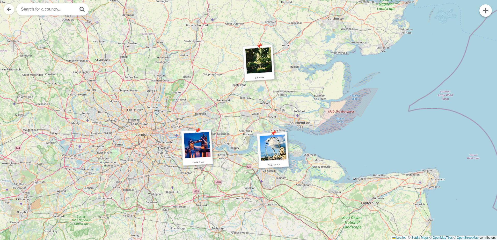

# 🗺️ Trail Tale

**Trail Tale** is a interactive travel mapping application designed to turn your journeys into immersive visual narratives. Explore your world, relive your adventures, and organize your memories on a stunning, responsive map.



---

### 🏆 Code Circuit Hackathon
Developed as part of the **Code Circuit Hackathon** conducted by **Outlier AI**.

---

## ✨ Features

### 🌍 Interactive World Map
- **Dynamic Exploration**: Powered by Leaflet.js with high-performance custom map tiles.
- **Smart Zooming**: Highlights countries on mouseover and features smooth "fly-to" navigation.
- **Responsive Scaling**: UI elements and markers dynamically adjust across screen sizes.

### 📸 Polaroid Album Markers
- **Tactile Visuals**: Albums are displayed as realistic Polaroid-style markers with custom tilts and shadows.
- **Dynamic Sizing**: Marker photos scale smoothly based on zoom levels (40px to 99px) for optimal clarity.
- **Clustering**: Smart display logic shows representative images at lower zooms to prevent map clutter.

### 🛠️ Advanced Album Management
- **Full CRUD Support**: Add, Edit, and Delete travel albums directly from the interface.
- **Slide-In Detail Panel**: A sleek, frosted-glass side panel for viewing and managing album metadata.
- **Location Picking**: Interactively set album coordinates by clicking directly on the map.
- **Multi-Image Support**: Add multiple photos to a single geo-tagged album.

### 🔍 Google Maps Style Search
- **Smart Suggestions**: Quickly find and navigate to any country with an autocomplete search pill.
- **Cinematic Transitions**: Smoothly fly to searched locations with optimized map animations.

---

## 💻 Tech Stack

- **Framework**: [Next.js 15](https://nextjs.org/) (App Router)
- **Library**: [React 19](https://react.dev/)
- **Mapping**: [Leaflet.js](https://leafletjs.com/) & [React-Leaflet](https://react-leaflet.js.org/)
- **Language**: [TypeScript](https://www.typescriptlang.org/)

---

## 🚀 Getting Started

### Prerequisites
- Node.js 18.x or later
- npm or yarn

### Installation
1. Clone the repository:
   ```bash
   git clone https://github.com/amanmoon/trail_tale.git
   ```
2. Install dependencies:
   ```bash
   npm install
   ```
3. Run the development server:
   ```bash
   npm run dev
   ```
4. Open [http://localhost:3000](http://localhost:3000) in your browser.

---

